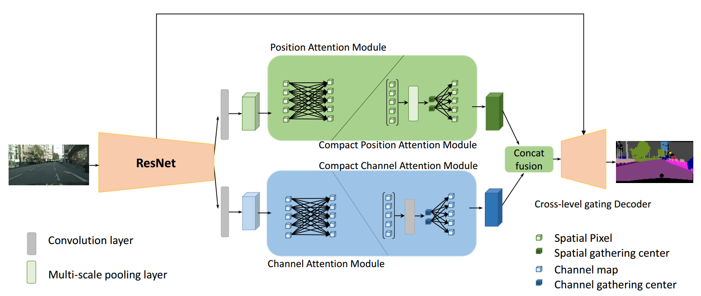
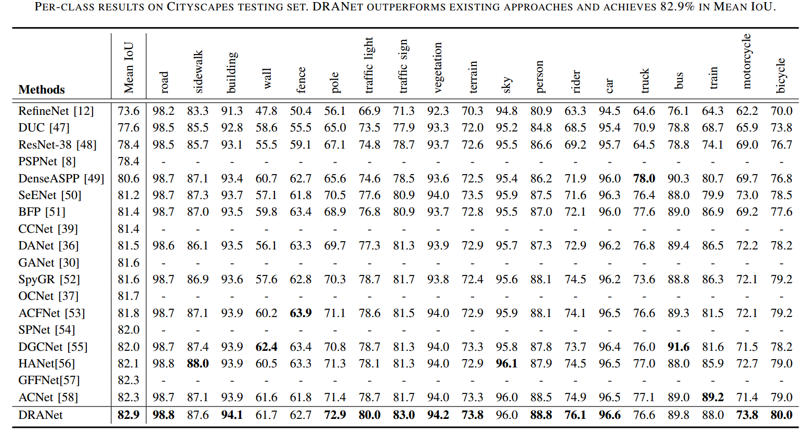

# Scene Segmentation with Dual Relation-aware Attention Network (TNNLS2020)

[Jun Fu](https://github.com/junfu1115/), [Jing Liu](http://www.nlpr.ia.ac.cn/iva/liujing/index.html), Jie jiang, [Yong Li](http://www.foreverlee.net), Yongjun Bao, and Hanqing Lu 

## Introduction

In this paper, we present a Dual Relation-aware Attention Network (DRANet) for scene segmentation, which adaptively integrates contextual information via an attention mechanism. Our proposed DRANet achieves outstanding performance consistently on four scene segmentation datasets, i.e. Cityscapes, ADE20K, PASCAL Context, and COCO Stuff.



## Cityscapes testing set result

We train our DRANet-101 with only fine annotated data and submit our test results to the official evaluation server.



## Usage

1. Install pytorch 

   - The code is tested on python3.6 and torch 1.4.0.
   - The code is modified from [PyTorch-Encoding](https://github.com/zhanghang1989/PyTorch-Encoding). 

2. Clone the resposity

   ```shell
   git clone https://github.com/junfu1115/DRANet.git 
   cd DRANet 
   python setup.py install
   ```

3. Dataset
   - Download the [Cityscapes](https://www.cityscapes-dataset.com/) dataset and convert the dataset to [19 categories](https://github.com/mcordts/cityscapesScripts/blob/master/cityscapesscripts/helpers/labels.py). 
   - Please put dataset in folder `./datasets`

4. Evaluation for DRANet

   - Download trained model [DRANet101](https://drive.google.com/file/d/1xCl2N0b0rVFH4y30HCGfy7RY3-ars7Ce/view?usp=sharing) and put it in folder `./experiments/segmentation/models/`

   - Evaluation code is in folder `./experiments/segmentation/`

   - `cd ./experiments/segmentation/`

   - For single scale testing, please run:

   - ```shell
     CUDA_VISIBLE_DEVICES=4,5,6,7 python test.py --dataset citys --model dran --backbone resnet101 --resume  models/dran101.pth.tar --eval --base-size 2048 --crop-size 768 --workers 1 --multi-grid --multi-dilation 4 8 16 --os 8 --aux
     ```

   - Evaluation Result

     The expected scores will show as follows: DRANet101 on cityscapes val set (mIoU/pAcc): **81.63/96.62** (ss) 

5. Evaluation for DANet

   - Download trained model [DANet101](https://drive.google.com/open?id=1XmpFEF-tbPH0Rmv4eKRxYJngr3pTbj6p) and put it in folder `./experiments/segmentation/models/`

   - `cd ./experiments/segmentation/`

   - For single scale testing, please run:

   - ```shell
     CUDA_VISIBLE_DEVICES=4,5,6,7 python test.py --dataset citys --model danet --backbone resnet101 --resume  models/DANet101.pth.tar --eval --base-size 2048 --crop-size 768 --workers 1 --multi-grid --multi-dilation 4 8 16 --os 8 --aux --no-deepstem
     ```

   - Evaluation Result

     The expected scores will show as follows: DANet101 on cityscapes val set (mIoU/pAcc): **79.93/95.97**(ss) 

## Acknowledgement

Thanks [PyTorch-Encoding](https://github.com/zhanghang1989/PyTorch-Encoding), especially the Synchronized BN!