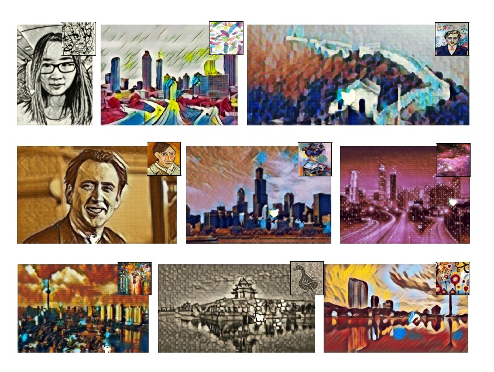

MSG-Net Style Transfer Example
==============================

We provide PyTorh Implementation of `MSG-Net`_ and `Neural Style`_ in the `GitHub repo <https://github.com/zhanghang1989/PyTorch-Style-Transfer>`_. 
We also provide `Torch <https://github.com/zhanghang1989/MSG-Net/>`_ and 
`MXNet <https://github.com/zhanghang1989/MXNet-Gluon-Style-Transfer>`_ implementations.

Tabe of content
---------------

- Real-time Style Transfer using `MSG-Net`_
    * `Stylize Images using Pre-trained Model`_
    * `Train Your Own MSG-Net Model`_

- `Neural Style`_

MSG-Net
-------

.. note::
    Hang Zhang, and Kristin Dana. "Multi-style Generative Network for Real-time Transfer."::

        @article{zhang2017multistyle,
            title={Multi-style Generative Network for Real-time Transfer},
            author={Zhang, Hang and Dana, Kristin},
            journal={arXiv preprint arXiv:1703.06953},
            year={2017}
        }

Stylize Images Using Pre-trained Model
--------------------------------------

- Clone the repo and download the pre-trained model::

    git clone git@github.com:zhanghang1989/PyTorch-Style-Transfer.git
    cd PyTorch-Style-Transfer/experiments
    bash models/download_model.sh

- Camera Demo::

    python camera_demo.py demo --model models/9styles.model

.. image:: ../_static/img/myimage.gif

- Test the model::

    python main.py eval --content-image images/content/venice-boat.jpg --style-image images/9styles/candy.jpg --model models/9styles.model --content-size 1024

  If you don't have a GPU, simply set ``--cuda=0``. For a different style, set ``--style-image path/to/style``.

  If you would to stylize your own photo, change the ``--content-image path/to/your/photo``. More options:

  * ``--content-image``: path to content image you want to stylize.
  * ``--style-image``: path to style image (typically covered during the training).
  * ``--model``: path to the pre-trained model to be used for stylizing the image.
  * ``--output-image``: path for saving the output image.
  * ``--content-size``: the content image size to test on.
  * ``--cuda``: set it to 1 for running on GPU, 0 for CPU.

.. raw:: html

     
    
    
    
    
    
    
    

Train Your Own MSG-Net Model
----------------------------

- Download the dataset::
  
    bash dataset/download_dataset.sh
  
- Train the model::

    python main.py train --epochs 4

  If you would like to customize styles, set ``--style-folder path/to/your/styles``. More options: 

  * ``--style-folder``: path to the folder style images.
  * ``--vgg-model-dir``: path to folder where the vgg model will be downloaded. 

  * ``--save-model-dir``: path to folder where trained model will be saved.
  * ``--cuda``: set it to 1 for running on GPU, 0 for CPU.

Neural Style
------------
`Image Style Transfer Using Convolutional Neural Networks <http://www.cv-foundation.org/openaccess/content_cvpr_2016/papers/Gatys_Image_Style_Transfer_CVPR_2016_paper.pdf>`_ by Leon A. Gatys, Alexander S. Ecker, and Matthias Bethge::

    python main.py optim --content-image images/content/venice-boat.jpg --style-image images/9styles/candy.jpg

* ``--content-image``: path to content image.
* ``--style-image``: path to style image.
* ``--output-image``: path for saving the output image.
* ``--content-size``: the content image size to test on.
* ``--style-size``: the style image size to test on.
* ``--cuda``: set it to 1 for running on GPU, 0 for CPU.

.. raw:: html

     
    
    
    
    
    
    
    

