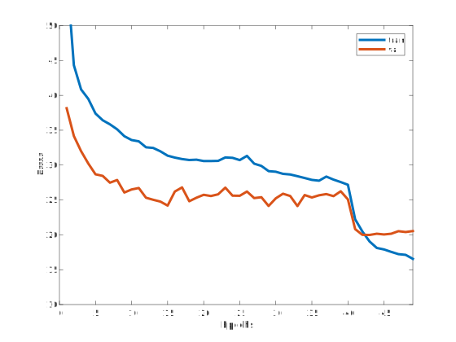

Deep TEN: Deep Texture Encoding Network Example
===============================================

.. image:: ../_static/img/cvpr17.svg
        :width: 100%
        :align: left

In this section, we show an example of training/testing Encoding-Net for texture recognition on MINC-2500 dataset. Comparing to original Torch implementation, we use *different learning rate* for pre-trained base network and encoding layer (10x), disable color jittering after reducing lr and adopt much *smaller training image size* (224 instead of 352). 

.. note::
    **Make Sure** to `Install PyTorch Encoding <../notes/compile.html>`_ First.

Test Pre-trained Model
----------------------

- Clone the GitHub repo (I am sure you did during the installation)::

    git clone git@github.com:zhanghang1989/PyTorch-Encoding.git

- Download the `MINC-2500 <http://opensurfaces.cs.cornell.edu/publications/minc/>`_ dataset to ``$HOME/data/minc`` folder. Download pre-trained model (training `curve`_ as bellow, pre-trained on train-1 split using single training size of 224, with an error rate of :math:`19.98\%` using single crop on test-1 set)::

    cd PyTorch-Encoding/experiments
    bash model/download_models.sh

.. _curve:

- Test pre-trained model on MINC-2500::

    >>> python main.py --dataset minc --model encodingnet --resume model/minc.pth.tar --eval
    # Teriminal Output:
    #[======================================== 23/23 ===================================>...]    Step: 104ms | Tot: 3s256ms | Loss: 0.719 | Err: 19.983% (1149/5750) 

Train Your Own Model
--------------------

- Example training command for training above model::

    python main.py --dataset minc --model encodingnet --batch-size 64 --lr 0.01 --epochs 60 

- Training options::

  -h, --help            show this help message and exit
  --dataset DATASET     training dataset (default: cifar10)
  --model MODEL         network model type (default: densenet)
  --widen N             widen factor of the network (default: 4)
  --batch-size N        batch size for training (default: 128)
  --test-batch-size N   batch size for testing (default: 1000)
  --epochs N            number of epochs to train (default: 300)
  --start_epoch N       the epoch number to start (default: 0)
  --lr LR               learning rate (default: 0.1)
  --momentum M          SGD momentum (default: 0.9)
  --weight-decay M      SGD weight decay (default: 1e-4)
  --no-cuda             disables CUDA training
  --plot                matplotlib
  --seed S              random seed (default: 1)
  --resume RESUME       put the path to resuming file if needed
  --checkname           set the checkpoint name
  --eval                evaluating

.. todo::
    Provide example code for extracting features.

Extending the Software
----------------------

This code includes an integrated pipeline and some visualization tools (progress bar, real-time training curve plots). It is easy to use and extend for your own model or dataset:

- Write your own Dataloader ``mydataset.py`` to ``dataset/`` folder

- Write your own Model ``mymodel.py`` to ``model/`` folder

- Run the program::

    python main.py --dataset mydataset --model mymodel

Citation
--------

.. note::
    * Hang Zhang, Jia Xue, and Kristin Dana. "Deep TEN: Texture Encoding Network." *The IEEE Conference on Computer Vision and Pattern Recognition (CVPR) 2017*::

        @InProceedings{Zhang_2017_CVPR,
        author = {Zhang, Hang and Xue, Jia and Dana, Kristin},
        title = {Deep TEN: Texture Encoding Network},
        booktitle = {The IEEE Conference on Computer Vision and Pattern Recognition (CVPR)},
        month = {July},
        year = {2017}
        }
