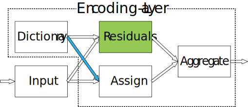

Deep TEN: Deep Texture Encoding Network Example
===============================================

In this section, we show an example of training/testing Encoding-Net for texture recognition on MINC-2500 dataset. Comparing to original Torch implementation, we use *different learning rate* for pre-trained base network and encoding layer (10x), disable color jittering after reducing lr and adopt much *smaller training image size* (224 instead of 352). 

Test Pre-trained Model
----------------------

- Clone the GitHub repo::

    git clone https://github.com/zhanghang1989/PyTorch-Encoding

- Install PyTorch Encoding (if not yet). Please follow the installation guide `Installing PyTorch Encoding <../notes/compile.html>`_.

- Download the `MINC-2500 <http://opensurfaces.cs.cornell.edu/publications/minc/>`_ dataset using the providied script::

    cd PyTorch-Encoding/
    python scripts/prepare_minc.py

- Test pre-trained model on MINC-2500. The pre-trained weight will be automatic downloaded (pre-trained on train-1 split using single training size of 224, with an error rate of :math:`18.96\%` using single crop on test-1 set)::

    python main.py --dataset minc --model deepten_resnet50_minc --nclass 23  --pretrained --eval
    # Teriminal Output:
    # Loss: 0.995 | Err: 18.957% (1090/5750): 100%|████████████████████| 23/23 [00:18<00:00,  1.26it/s]

Train Your Own Model
--------------------

- Example training command for training above model::

   CUDA_VISIBLE_DEVICES=0,1,2,3 python main.py --dataset minc --model deepten_resnet50_minc --batch-size 512 --lr 0.004 --epochs 80 --lr-step 60 --lr-scheduler step --weight-decay 5e-4

- Detail training options::

  -h, --help            show this help message and exit
  --dataset DATASET     training dataset (default: cifar10)
  --model MODEL         network model type (default: densenet)
  --backbone BACKBONE   backbone name (default: resnet50)
  --batch-size N        batch size for training (default: 128)
  --test-batch-size N   batch size for testing (default: 1000)
  --epochs N            number of epochs to train (default: 300)
  --start_epoch N       the epoch number to start (default: 0)
  --lr LR               learning rate (default: 0.1)
  --momentum M          SGD momentum (default: 0.9)
  --weight-decay M      SGD weight decay (default: 1e-4)
  --no-cuda             disables CUDA training
  --plot                matplotlib
  --seed S              random seed (default: 1)
  --resume RESUME       put the path to resuming file if needed
  --checkname           set the checkpoint name
  --eval                evaluating

Citation
--------

.. note::
    * Hang Zhang, Jia Xue, and Kristin Dana. "Deep TEN: Texture Encoding Network." *The IEEE Conference on Computer Vision and Pattern Recognition (CVPR) 2017*::

        @InProceedings{Zhang_2017_CVPR,
        author = {Zhang, Hang and Xue, Jia and Dana, Kristin},
        title = {Deep TEN: Texture Encoding Network},
        booktitle = {The IEEE Conference on Computer Vision and Pattern Recognition (CVPR)},
        month = {July},
        year = {2017}
        }
