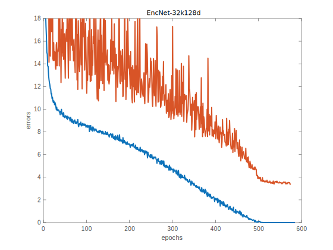

EncNet on CIFAR-10
==================

Test Pre-trained Model
----------------------

- Clone the GitHub repo::

    git clone git@github.com:zhanghang1989/PyTorch-Encoding.git

- Install PyTorch Encoding (if not yet). Please follow the installation guide `Installing PyTorch Encoding <../notes/compile.html>`_.

- Download pre-trained EncNet-32k128d model::

    cd PyTorch-Encoding/experiments/recognition
    bash model/download_models.sh

.. _curve:

- Test EncNet-32k128d pre-trained model (training `curve`_ of this model is shown above, with a final error rate of :math:`3.35\%`)::

    >>> python main.py --dataset cifar10 --model encnetdrop --widen 8 --ncodes 32 --resume model/encnet_cifar.pth.tar --eval
    # Teriminal Output:
    #Loss: 0.129 | Err: 3.350% (335/10000): 100%|█████████████████████████████████████████████| 79/79 [00:49<00:00,  1.58it/s]
    # Error rate is 3.350 

Train Your Own Model
--------------------

- Example training command for training above model::

    CUDA_VISIBLE_DEVICES=0,1 python main.py --dataset cifar10 --model encnetdrop --widen 8 --ncodes 32 --lr-scheduler cos --epochs 600 --checkname mycheckpoint

- Detail training options::

  -h, --help            show this help message and exit
  --dataset DATASET     training dataset (default: cifar10)
  --model MODEL         network model type (default: densenet)
  --widen N             widen factor of the network (default: 4)
  --ncodes N            number of codewords in Encoding Layer (default: 32)
  --batch-size N        batch size for training (default: 128)
  --test-batch-size N   batch size for testing (default: 1000)
  --epochs N            number of epochs to train (default: 300)
  --start_epoch N       the epoch number to start (default: 0)
  --lr LR               learning rate (default: 0.1)
  --momentum M          SGD momentum (default: 0.9)
  --weight-decay M      SGD weight decay (default: 1e-4)
  --no-cuda             disables CUDA training
  --plot                matplotlib
  --seed S              random seed (default: 1)
  --resume RESUME       put the path to resuming file if needed
  --checkname           set the checkpoint name
  --eval                evaluating

Citation
--------

.. note::
    * Hang Zhang, Kristin Dana, Jianping Shi, Zhongyue Zhang, Xiaogang Wang, Ambrish Tyagi, Amit Agrawal. "Context Encoding for Semantic Segmentation"  *The IEEE Conference on Computer Vision and Pattern Recognition (CVPR) 2018*::

        @InProceedings{Zhang_2018_CVPR,
        author = {Zhang, Hang and Dana, Kristin and Shi, Jianping and Zhang, Zhongyue and Wang, Xiaogang and Tyagi, Ambrish and Agrawal, Amit},
        title = {Context Encoding for Semantic Segmentation},
        booktitle = {The IEEE Conference on Computer Vision and Pattern Recognition (CVPR)},
        month = {June},
        year = {2018}
        }
